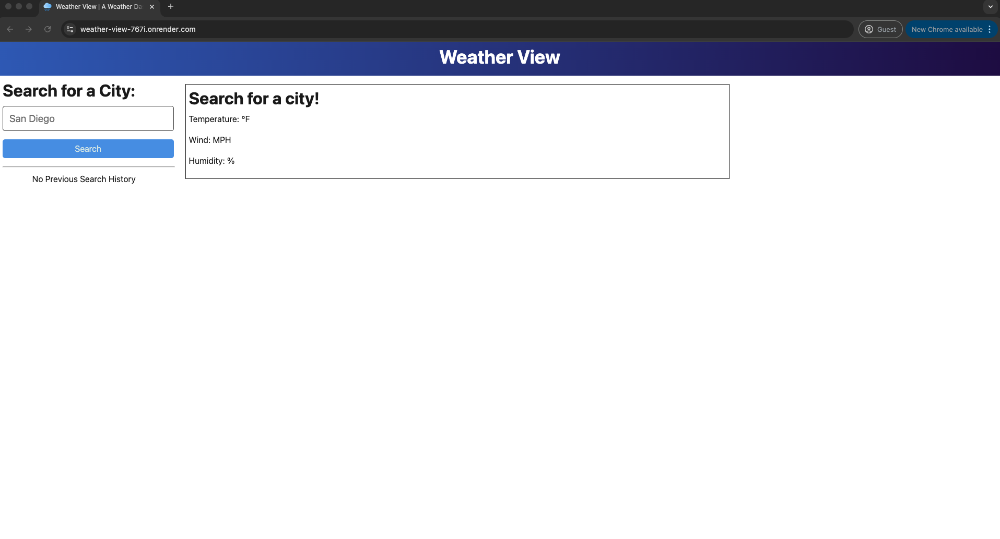
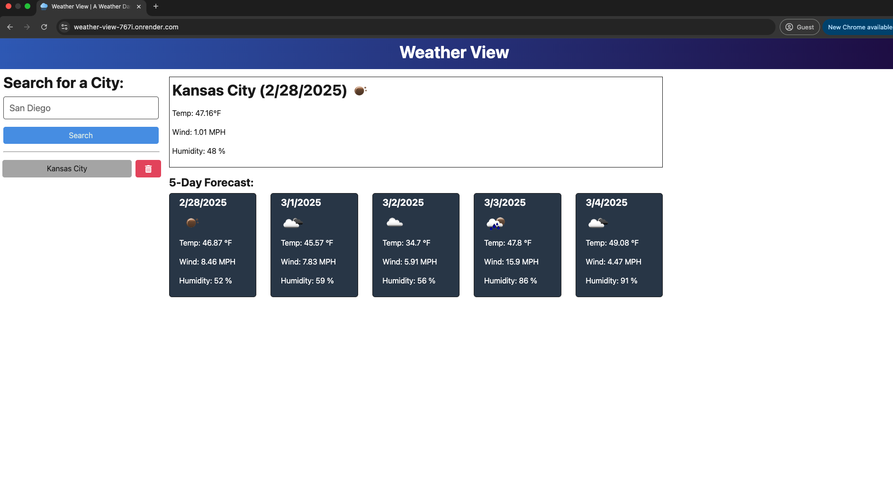
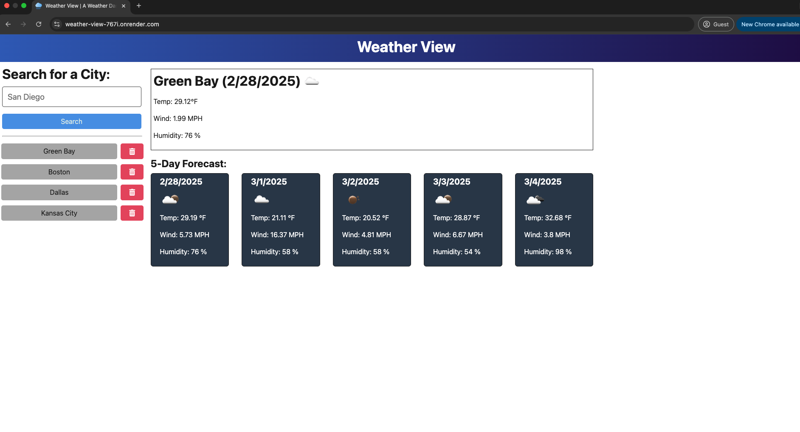

# Weather View

## Description

Weather View is a web application for checking the current weather conditions and the forecast for your city.

## Table of Contents

- [Installation](#installation)
- [Usage](#usage)
- [Credits](#credits)
- [License](#license)
- [Contributing](#contributing)
- [Tests](#tests)
- [Questions](#questions)

## Installation

To use the project, click this [link](https://weather-view-767i.onrender.com/).

## Usage

After clicking on the above link, let the wb application load.

NOTE: The application server sleeps when no activity is detected, so it will likely take up to a minute for the web page to load. Just be patient!

Once the webpage loads, you wil be presented with this screen.

Following the prompts, type the name of your city into the search bar and click "Search". The current weather will then display for your city in the main window and below it, five cards will display that show the 5 day forecast for that city. The cities you have searched will show on the left of the screen.

Items in that history can deleted by selecting the trash can button to the right of each name.

To search a different city, just type its name into the search bar. Cities you have already entered can be quickly searched by clicking on their name in the history queue.

## Credits

- The favicon for the browser tab was taken from [Flaticon](https://www.flaticon.com/free-icons/rain).
- GitHub CoPilot was used extensively for debugging and explaining the server side code in VS Code.

## License

Licensed under the [MIT](./LICENSE) license.

## Contributing

To contribute, clone the repository onto your local machine, edit and push to a feature branch. Open a pull request so your changes can be reviewed. If they improve the app, we will merge your changes to the main branch code.

## Tests

There are currently no test instructions developed for this project.

## Questions

- GitHub: [Johngoldade](https://github.com/Johngoldade)
- Email: [goldade.john@gmail.com](mailto:goldade.john@gmail.com)

To ask further questions, reach out to me at the above email and I will get back to you as soon as I can.

